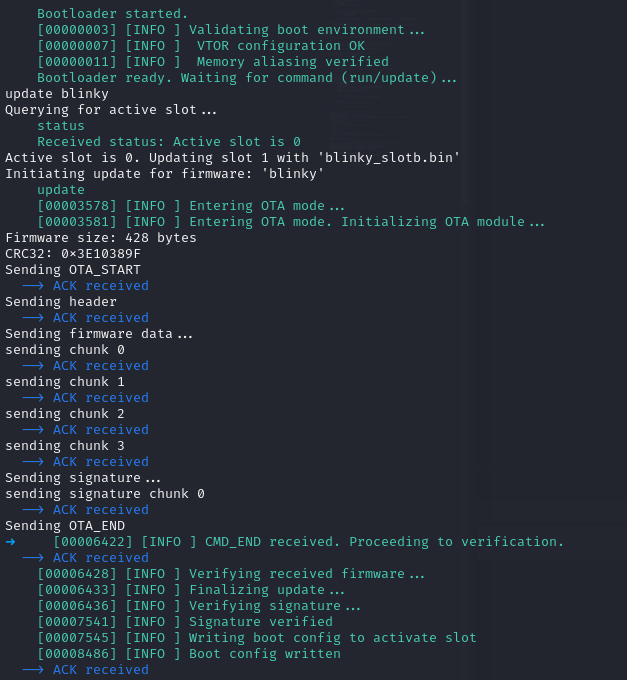

# STM32 Secure Bootloader with BLE OTA Updates

This project showcases a secure bootloader for an STM32 microcontroller, enabling cryptographically authenticated firmware updates Over-the-Air (OTA) via Bluetooth Low Energy (BLE).

The system uses an ESP32-WROOM module as a BLE-to-UART bridge, allowing a host PC to securely connect and send new firmware to the STM32. The host communicates using Python scripts that provide a command-line interface for interaction and are accompanied by a full suite of pytest integration tests.

## Repository Structure

```
.
├── docs                               <- Project documentation, architecture diagrams, security insights, setup guides
├── host_pc                            <- All host-side Python tools, OTA clients, and automated tests
├── esp32                              <- ESP32 bridge firmware projects
│   ├── esp32_ble_bridge                 <- ESP32 BLE-to-UART bridge firmware (PlatformIO project)
│   └── esp32_bt_bridge                  <- ESP32 Bluetooth Classic bridge firmware 
├── stm32                              <- STM32 embedded firmware projects
│   ├── bootloader                       <- The core STM32 Secure Bootloader firmware project
│   └── applications                     <- Example application firmware for the bootloader (e.g., blinky, UART echo)
├── development_projects               <- Older iterations or proof-of-concept projects that were stepping stones
```


## Key Features

- **Secure Firmware Update:** Implements ECDSA signature verification to ensure the authenticity and integrity of firmware before flashing, preventing unauthorized code execution and malicious tampering.
- **Dual-Bank (A/B) Updates:** Supports atomic and fault-tolerant OTA updates by writing new firmware to an inactive bank, minimizing downtime and providing rollback capability.
- **Over-the-Air (OTA) Capability:** Leverages BLE for wireless firmware delivery, bridging to UART for efficient communication with the STM32
- **Bare-Metal Embedded C:** The STM32 bootloader is developed in C at the register access level, showcasing a deep understanding of microcontroller internals and efficient resource management without relying on HAL libraries.
- **Embedded Cryptography:** Integrates mbedTLS for cryptographic operations, specifically for ECDSA signature verification.
- **Dual-MCU Architecture:** Utilizes the STM32 for real-time application processing and the ESP32-WROOM for efficient wireless connectivity.
- **Host-Side Automation & Testing:** Custom Python scripts provide a sophisticated command-line interface (CLI) for firmware management, accompanied by a full suite of Pytest integration tests for automated, end-to-end validation of the secure OTA flow.
- **Automated Integration Testing:** Includes a test suite using pytest to validate the entire 

## System Architecture
**[./docs/architecture.md](./docs/architecture.md)**: more details on system architecture

The system consists of three main components that communicate in a chain:

- **Host PC:** Runs the Python scripts to initiate and manage the OTA update.
- **ESP32-WROOM:** Acts as a wireless bridge, receiving commands and firmware via BLE from the host and forwarding them over UART.
- **STM32:** Runs the secure bootloader, receives data from the ESP32 via UART, validates the firmware's signature, and performs the flash programming.

The communication flow is as follows: 
`[Host PC] <--- Bluetooth Low Energy (BLE) ---> [ESP32-WROOM] <--- UART ---> [STM32]`

## Getting Started 

To get the project fully operational—from hardware wiring to performing your first secure OTA update—please follow the comprehensive guide provided in **[SETUP.md](./SETUP.md)**.

The setup guide covers:
1.  **Environment & Toolchain Installation**
2.  **Hardware Wiring and Connections**
3.  **Initial Firmware Flashing** (for both STM32 and ESP32)
4.  **A Step-by-Step First OTA Update**
5.  **Running the Automated Test Suite**

The tests will automatically handle connecting to the device, sending various firmware (including valid, invalid, and large files), and verifying the bootloader's responses and behavior on the STM32.

## Usage: Performing an OTA Update

All host-side operations are managed from the `host_pc/` directory. After following the initial setup in `SETUP.md`, you can use the interactive client to manage the device.

1.  **Activate the Python Environment:**
    ```bash
    # (From the project root)
    source host_pc/venv/bin/activate
    ```

2.  **Run the OTA Client:**
    The client automatically scans for and connects to the ESP32 BLE bridge.
    ```bash
    # (From the project root)
    python host_pc/ota_client/ble_ota_client.py
    ```

3.  **Interact with the Bootloader:**
    You will be presented with a command-line interface to issue commands like `update <firmware_name>`, `run`, `reboot`, and `help` to the STM32.

    **Example Interaction:**

    
---

## Running Automated Tests

The project includes a robust integration test suite to ensure the system works end-to-end. The tests automatically handle connecting to the device, sending various firmware payloads (valid, invalid, corrupted, etc.), and verifying the bootloader's behavior.

To run the tests, execute `pytest` from the `host_pc/integration_tests` directory:

```bash
# Navigate to the integration tests directory
cd host_pc/integration_tests

# Ensure your Python venv is active
python -m pytest -s
```
