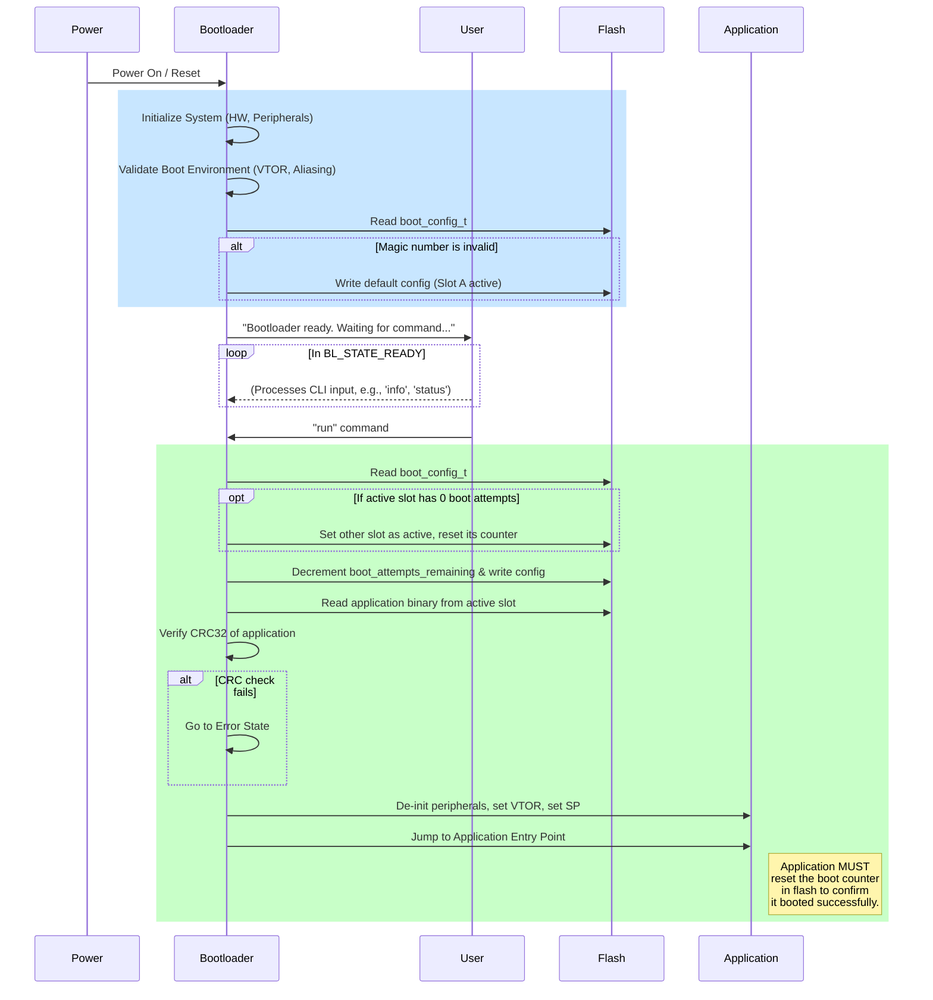
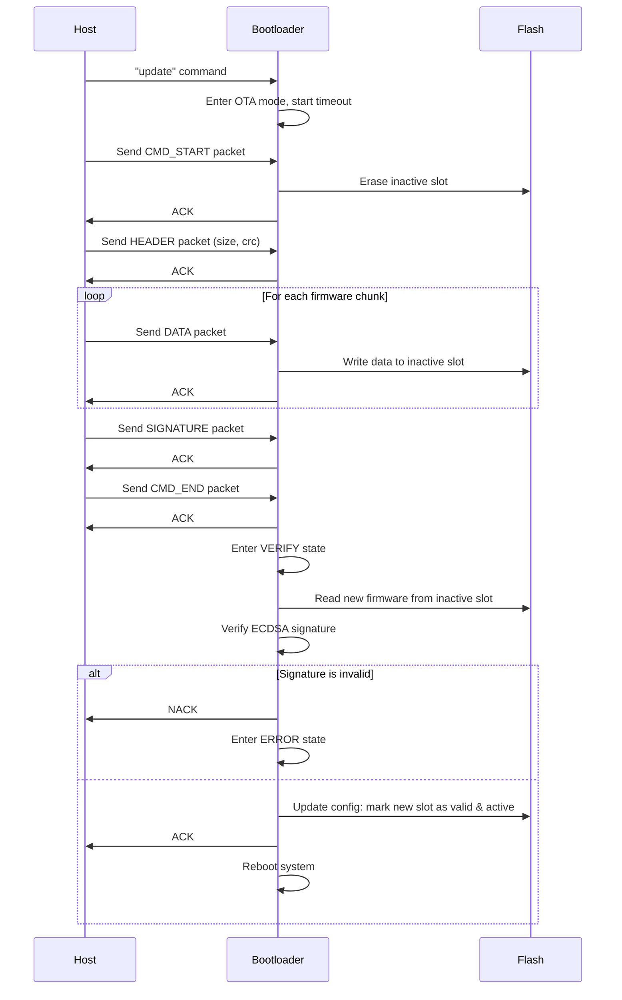

# Secure Bootloader Architecture

## 1. Overview & Core Principles

This document outlines the architecture of the secure bootloader for the STM32F767xx platform. The bootloader's primary responsibility is to establish a chain of trust by verifying and then launching the main application firmware. It is designed from the ground up to be secure, robust, and modular.

The architecture is built on three core principles:

* **Security**: Firmware authenticity and integrity are paramount. The system will not boot an application unless its cryptographic signature can be verified against a trusted, embedded public key.
* **Robustness**: The system is resilient to failed updates and unexpected runtime failures in the application. It is designed to be "unbrickable" in the field by providing fail-safe mechanisms.
* **Modularity**: The codebase is partitioned into distinct modules with clear responsibilities, such as boot-flow management, update handling, and cryptographic services.

The design employs several key architectural patterns, including a **State Machine** for managing operational modes, **A/B Partitioning** for updates, and an **Update Agent** model for handling the OTA protocol.

## 2. Memory Layout

The STM32F767xx's 2MB of internal flash is partitioned to support the A/B update strategy and isolate the bootloader from application code. The bootloader itself executes from the high-performance ITCM-aliased flash region (`0x00200000`), though it is physically located at the base of flash. This is verified at startup.

| Region | Start Address | End Address | Size | Sectors | Description |
| :--- | :--- | :--- | :--- | :--- | :--- |
| **Bootloader** | `0x08000000` | `0x0803FFFF` | 256KB | 0-3 | Contains the immutable bootloader code. Should be protected by readout/write protection fuses. |
| **Application Slot A** | `0x08040000` | `0x080FFFFF` | 768KB | 4-7 | New firmware is loaded here when Slot B is active|
| **Application Slot B** | `0x08100000` | `0x081BFFFF` | 768KB | 8-10 | New firmware is loaded here when Slot A is active |
| **Config Sector** | `0x081C0000` | `0x081FFFFF` | 256KB | 11 | Stores the boot configuration structure, which manages the A/B state and rollback mechanism. |

## 3. Architectural Decisions & Rationale

This section details the key design decisions that shape the bootloader's behavior.

### 3.1. A/B Partitioning for Updates

The decision to use two distinct application slots (A and B) is central to the bootloader's robustness.

* **Rationale**: This pattern ensures that a valid, working application is always present on the device. An update is written to the *inactive* slot while the current application continues to function (if this were a live-update system) or remains bootable. Only after the new firmware is fully received and verified is the system configured to boot from it. This eliminates the risk of a corrupted application due to a power loss or failed transfer during the update process.

### 3.2. Boot Counter & Automatic Rollback

A simple "successful boot" is not enough to guarantee an application is healthy. It could pass verification but crash due to a runtime bug.

* **Rationale**: To mitigate this, the bootloader employs a boot attempt counter. When attempting to boot an application, it first decrements a counter in the configuration sector. If the application boots successfully, it is the *application's responsibility* to signal its health to the bootloader, which resets the counter. If the application fails to do this (e.g., it crashes and the device reboots), the counter will eventually reach zero. At this point, the bootloader will automatically roll back to the other slot, assuming it contains a valid, known-good firmware image. This prevents a faulty update from permanently "bricking" the device.

### 3.3. Atomic Configuration Swaps

The state of the A/B system is controlled by the `bootloader_config_t` struct. Its integrity is critical.

* **Rationale**: All updates to the boot configuration are performed atomically. The entire flash sector containing the configuration is erased and rewritten in a single operation. This minimizes the window for corruption.

### 3.4. Asymmetric Cryptography (ECDSA) for Firmware Signing

Firmware integrity and authenticity are verified using the Elliptic Curve Digital Signature Algorithm (ECDSA).

* **Rationale**: Asymmetric cryptography allows us to embed only the **public key** in the bootloader. The corresponding **private key**, which is used to sign firmware images, can be kept secure and offline. An attacker who gains access to the device cannot extract the private key to sign malicious firmware. ECDSA (specifically `secp256r1`) was chosen for its strong security guarantees with relatively small key and signature sizes, which is ideal for embedded systems.

### 3.5. Custom OTA Protocol

Instead of a standard file transfer protocol like XMODEM/YMODEM, a simple, custom packet-based protocol is used.

* **Rationale**: A custom protocol provides tight control over the update flow and minimizes code size. It allows for a lightweight, stateful parser that can process data byte-by-byte as it arrives over the UART. The defined frame structure (with SOF, EOF, and CRC32) provides robust error detection and synchronization, while the ACK/NACK responses give the host-side update tool clear feedback at each stage of the process (erasure, data write, verification).

## 4. System Components

The architecture is divided into the following logical components:

### 4.1. Bootloader Core & State Machine

* **Responsibility**: Manages the overall state of the device during the boot-up phase. It orchestrates the other components and decides the boot-flow path throughout the command line interface. 
* **Interface**: It exposes a simple state machine (`READY`, `RECEIVING`, `VERIFY`, `ERROR`) that dictates the system's current mode of operation.

### 4.2. Configuration & State Management

* **Responsibility**: To persistently store and manage the A/B system state. This includes tracking the active slot, firmware metadata (CRC, size), and the rollback boot counter.
* **Interface**: Provides functions to read the current configuration, write an updated configuration atomically, and initialize a default configuration if one is not present or is corrupt.

### 4.3. Command-Line Interface (CLI)

* **Responsibility**: Provides a human interface for interaction and control over the bootloader via UART.
* **Design**: The CLI is context-aware. It presents a full set of commands in its normal `READY` state and a restricted, fail-safe command set when the bootloader enters an `ERROR` state, prioritizing recovery actions.

### 4.4. OTA Update Agent

* **Responsibility**: To manage the entire firmware update process. This involves listening for incoming data, parsing it according to the defined OTA protocol, writing the firmware image to the inactive flash slot, and handling session timeouts.
* **Interface**: It is activated by the Core State Machine and runs non-blockingly, processing bytes as they arrive. Once the transfer is complete, it signals the core to transition to the verification state.

### 4.5. Cryptographic Services

* **Responsibility**: To provide cryptographic functions for security. Its primary role is to verify the signature of a new firmware image.
* **Interface**: Exposes a clear function to verify a block of data against a signature using the embedded public key. It abstracts the complexities of the underlying `mbedTLS` library.

## 5. Operational Flows

The following diagrams illustrate the key operational sequences.

### 5.1. Boot and Application Launch Sequence

### 5.2. OTA Firmware Update Sequence
This diagram shows the interaction between a host update tool and the bootloader to install new firmware.

